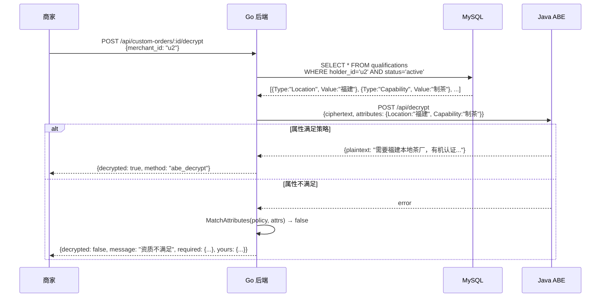
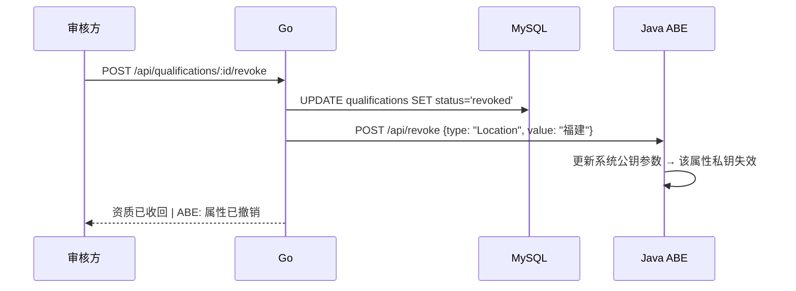
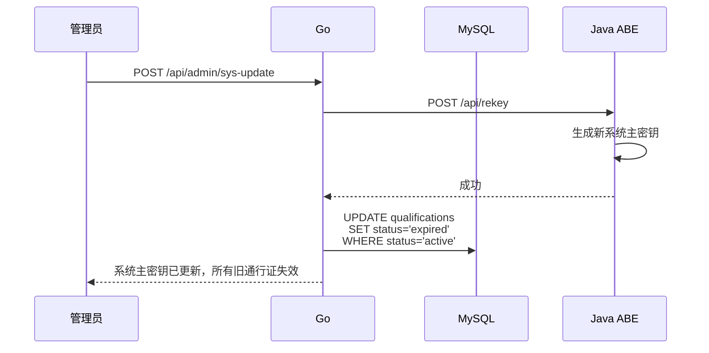

# ABE 属性基加密详解

> 本文档从原理到实现完整讲解农禾坊的 ABE 加密体系，是理解这个项目最核心的文档。

---

## 一、什么是 ABE？为什么用它？

### 传统加密 vs ABE

```
传统加密：用 Bob 的公钥加密 → 只有 Bob 能解密（一对一）
ABE 加密：用策略 "(Location=福建 AND Capability=制茶)" 加密 → 
          属性满足该策略的所有用户都能解密（一对多）
```

### 业务场景

消费者想发布需求"需要福建本地的制茶厂帮我定制茶饼"。如果直接公开：
- 所有商家都能看到，包括不满足条件的
- 消费者的具体需求和预算完全暴露

用 ABE 后：
- 需求描述被加密存储
- 只有持有 `Location=福建` + `Capability=制茶` 属性的商家才能解密查看
- 其他商家只能看到需求标题，看不到详细描述

---

## 二、密码学基础：MAFASAC-AR

### 方案全称

**MAFASAC-AR** = Multi-Authority Fully Secure Attribute-Based Encryption with Access Control and Attribute Revocation

### 核心参数

| 参数 | 值 | 含义 |
|------|-----|------|
| 数学基础 | 复合阶双线性群 | $G = G_{p_1} \times G_{p_2} \times G_{p_3}$, 群阶 $N = p_1 p_2 p_3$ |
| 曲线 | Type A1 | JPBC 支持的配对友好曲线 |
| 安全级别 | 256-bit | $\lambda = 256$ |
| 访问结构 | LSSS (线性秘密共享) | Vandermonde 矩阵，$(l, k)$ 形式 |
| 授权方数量 | 5（全局属性数） | 每个属性一个独立授权方 |
| 撤销支持 | ✓ | SysUpd / KeyUpd / CTUpd 三种机制 |

### LSSS 访问矩阵

策略 `(Location=福建, Capability=制茶; 2)` 用 2×2 Vandermonde 矩阵实现：

```
M = [1, 1]
    [1, 2]
```

两个属性条件各自对应矩阵的一行，解密时需要两行都满足（AND 逻辑）。

---

## 三、策略表达式

### 5 种条件类型

| 条件 | 字段名 | 可选值 |
|------|--------|--------|
| 产地要求 | `Location` | 福建/山东/浙江/云南/安徽/四川/广东 |
| 加工能力 | `Capability` | 制茶/果蔬加工/糕点制作/酿造/干货加工/冷冻加工 |
| 品质认证 | `Quality` | 有机/绿色/地理标志/无公害 |
| 等级要求 | `Grade` | 1/2/3/4/5 |
| 有机认证 | `Organic` | 是/否 |

### 策略格式

```
(属性1=值1, 属性2=值2, ..., 属性N=值N; N)
```

N = 条件数量（也是 LSSS 矩阵的行数），所有条件 AND 逻辑。

### 示例

| 需求 | 策略 |
|------|------|
| 只要福建厂商 | `(Location=福建; 1)` |
| 福建 + 制茶 | `(Location=福建, Capability=制茶; 2)` |
| 福建 + 制茶 + 有机 + 3级 | `(Location=福建, Capability=制茶, Quality=有机, Grade=3; 4)` |

### 代码实现

```go
// backend/internal/service/abe_service.go
func ConditionToPolicy(conditions map[string]string) string {
    var parts []string
    count := 0
    for k, v := range conditions {
        if v != "" {
            parts = append(parts, fmt.Sprintf("%s=%s", k, v))
            count++
        }
    }
    if count == 0 { return "" }
    return fmt.Sprintf("(%s; %d)", strings.Join(parts, ", "), count)
}
```

---

## 四、ABE 服务端点（Java :8081）

Java 密码学服务提供 5 个端点，Go 后端通过 HTTP 调用：

| 端点 | 方法 | Go 调用函数 | 说明 |
|------|------|-----------|------|
| `/api/encrypt?n=N` | POST | `EncryptWithABE(text, n)` | 加密，N=条件数 → N×N LSSS 矩阵 |
| `/api/decrypt` | POST | `DecryptWithABE()` | 解析属性数 → KeyGen → Dec |
| `/api/revoke` | POST | `RevokeAttribute()` | SysUpd() 更新全局公钥参数 |
| `/api/rekey` | POST | `UpdateSystemKeys()` | SysUpd() 全局密钥轮换 |
| `/api/reencrypt` | POST | `ReEncryptContent()` | CTUpd() 旧密文适配新密钥 |

> ⚠️ 解密端点从 GET 改为 POST（修复了 Go 后端发 POST、Java 只收 GET 的 bug，此前 ABE 解密一直走降级匹配）。

### 全局共享 GPP 架构

```java
// 启动时创建单例，所有会话共用
globalP4 = new MAFASACAR();
globalP4.GlobalSetup();    // GPP 只创建一次
globalP4.AuthSetup(5);     // 5 个属性授权方

// 加密会话借用全局 GPP/AA
session.GPP = globalP4.GPP;
session.AA  = globalP4.AA;
session.KeyGen(GPP, 0, n); // n = 条件数
session.Enc(GPP, n, n);    // 动态 LSSS 矩阵

// 撤销直接改全局 — 所有会话立刻失效
globalP4.SysUpd();         // GPP.RP 更新
```

### Java 加密实现

```java
// CryptoServer.java — POST /api/encrypt?n=3
int n = parseQueryParam("n", 3);
MAFASACAR p4 = new MAFASACAR();
p4.GPP = globalP4.GPP;     // 共享全局参数
p4.AA = globalP4.AA;       // 共享全局授权方
p4.KeyGen(p4.GPP, 0, n);   // n 个属性的用户密钥
p4.setM(p4.GPP, plainText);
p4.Enc(p4.GPP, n, n);      // n×n LSSS 矩阵
String id = UUID.randomUUID().toString();
sessions.put(id, p4);
// 返回 {"id": "uuid", "status": "encrypted"}
```

### Java 解密实现

```java
// CryptoServer.java — POST /api/decrypt
String id = extractId(body);     // 从密文中提取 session ID
int attrCount = countAttributes(body); // 商家实际属性数
MAFASACAR p4 = sessions.get(id);
p4.KeyGen(p4.GPP, 0, attrCount); // 用实际属性数重新生成密钥
p4.Dec(p4.GPP);
boolean ok = p4.validDec();
if (ok) return plaintext;
else return 403; // 属性不满足策略
```

---

## 五、完整数据流

### 阶段 1：消费者加密发布

```mermaid
sequenceDiagram
    participant 消费者
    participant Go as Go 后端
    participant Java as Java ABE
    participant DB as MySQL

    消费者->>Go: POST /api/custom-order<br/>conditions: {Location:"福建", Capability:"制茶"}
    Go->>Go: ConditionToPolicy → "(Location=福建, Capability=制茶; 2)"
    Go->>Java: POST /api/encrypt (需求描述文本)
    Java->>Java: GlobalSetup → AuthSetup → KeyGen → Enc
    Java-->>Go: {id: "uuid-xxx", status: "encrypted"}
    Go->>DB: INSERT custom_orders<br/>(title, policy, session_id, ciphertext)
    Go-->>消费者: 发布成功
```

**数据库存储**：

| 字段 | 值 | 可见性 |
|------|-----|--------|
| `title` | "牛奶味茶饼定制" | 公开 |
| `description` | "需要福建本地茶厂..." | 原文备份，前端不直接展示 |
| `policy` | `(Location=福建, Capability=制茶; 2)` | 公开 |
| `session_id` | `uuid-xxx` | 隐藏 |
| `ciphertext` | ABE 密文 | 隐藏 |

### 阶段 2：商家 ABE 解密



### 阶段 3：审核方撤销属性



### 阶段 4：管理员密钥轮换



---

## 六、三层降级策略

当 Java ABE 服务不可用时，系统自动降级：

| 操作 | ABE 可用 | ABE 不可用 |
|------|---------|-----------|
| 加密 | Java 生成密文 | 返回明文存储 |
| 解密 | 密码学验证属性 | `MatchAttributes()` 字符串匹配 |
| 撤销 | 更新 ABE 系统参数 | DB 标记 revoked，等待 SysUpdate |
| 轮换 | 全局重生成密钥 | 仅 DB 将所有资质标记 expired |

**降级匹配逻辑**：

```go
func MatchAttributes(policy string, attributes map[string]string) bool {
    // 解析 "(Location=福建, Capability=制茶; 2)"
    // 逐对比较：Location=福建? Capability=制茶?
    // 全部匹配 → true，任一不匹配 → false
}
```

---

## 七、密码学安全属性

| 属性 | 含义 | 如何保证 |
|------|------|---------|
| **数据机密性** | 不满足策略者无法解密 | LSSS 秘密共享 + 双线性群困难问题 |
| **抗合谋** | 用户 A 的 Location + 用户 B 的 Capability 无法联合解密 | 密钥与用户 GID 绑定，分量基于不同随机数 |
| **前向安全** | 撤销后旧密钥无法解密新密文 | 撤销操作更新系统公钥 |
| **后向安全** | 撤销后新密钥无法解密旧密文 | 需 `ReEncryptContent()` 配合 |
| **多授权方安全** | 攻破一个授权方不能伪造其他属性 | 各授权方独立密钥分量 |

### 密钥层次

```
系统主密钥 (GlobalSetup 生成)
  ├── APK₁ → 福建工商认证中心 → 管辖 Location, Grade
  ├── APK₂ → 有机食品认证协会 → 管辖 Quality, Organic
  ├── ...
  └── 用户私钥 (SK) ← 各授权方分量组合
```

---

## 八、代码文件索引

| 文件 | 关键内容 |
|------|---------|
| `backend/internal/service/abe_service.go` | 6 个 ABE 核心函数 + 策略转换 + 降级匹配 |
| `backend/internal/handler/custom_order.go` | `HandleCreateCustomOrder` (加密), `HandleDecryptCustomOrder` (解密) |
| `backend/internal/handler/certifier.go` | `HandleRevokeQualification` → 触发 `RevokeAttribute` |
| `backend/internal/handler/admin.go` | `HandleSysUpdate` → 触发 `UpdateSystemKeys` + `ExpireAllQualifications` |
| `crypto_service/CryptoServer.java` | Java ABE HTTP 服务, 5 端点, MAFASACAR 调用 |
| `crypto_service/java/MAFASACAR/MAFASACAR.java` | ABE 算法完整实现 |
| `backend/internal/repository/mysql_repo.go` | `GetQualificationsByHolder`, `RevokeQualification`, `ExpireAllQualifications` |

---

## 相关文档

- [[系统架构全景]] — 整体架构中 ABE 的位置
- [[角色-API-数据库]] — 各角色在 ABE 流程中的操作和对应 API
- [[部署运维与演示]] — 如何启动 ABE 服务和演示
