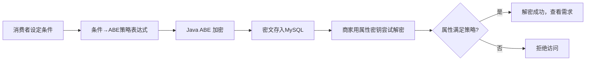

---
tags:
  - overview
  - abe
  - blockchain
created: 2026-06-14
aliases:
  - 农禾坊
  - NongHeFang
  - 智慧农业隐私追溯平台
---

# 农禾坊 — 智慧农业隐私追溯平台

## 一句话简介

基于 **属性基加密（ABE）** 和 **区块链** 的农产品隐私追溯平台——消费者用加密条件定向发布需求，只有持有匹配资质的商家才能解密查看。

## 项目定位

传统农产品电商平台存在两个核心痛点：

1. **供需信息不对称**：消费者有定制需求（如"只要福建产的有机茶"），但找不到精准匹配的供应商
2. **隐私泄露风险**：需求公开发布后，所有商家（包括不满足条件的）都能看到详情，消费者隐私无法保障

农禾坊通过 **ABE 属性基加密** 解决这一问题：消费者发布需求时设定访问条件（产地、加工能力、认证等级等），需求描述被 ABE 加密后存储，只有持有匹配属性密钥的商家才能解密查看真实内容。

## 技术栈总览

| 层级     | 技术选型                       | 说明                        |
| ------ | -------------------------- | ------------------------- |
| 前端     | Vue 3 CDN + 原生 HTML/CSS/JS | 无构建工具 SPA，森林绿现代简约设计       |
| 后端     | Go 1.25+ + Gin             | 40 条 API 路由，轻量高性能         |
| 数据库    | MySQL 8.0 (Docker)         | 持久化存储，9 用户 + 28 商品 + 7 资质 |
| 密码学    | Java 17 + JPBC             | MAFASAC-AR 方案，复合阶双线性群     |
| 区块链    | Hyperledger Fabric 2.3     | 追溯链码（可选组件）                |
| ABE 方案 | 复合阶群 + LSSS 访问结构           | 支持属性撤销和密钥轮换               |

## 核心创新点

### 1. ABE 加密的定向需求发布



### 2. 五角色 ABE 权限模型

| 角色 | ABE 对应概念 | 核心操作 |
|------|-------------|----------|
| 🛒 消费者 | DataOwner | 设定访问策略、加密发布需求 |
| 🏭 商家 | DataUser | 持有属性密钥、解密查看需求 |
| 🏛️ 审核方 | AttributeAuthority | 颁发/撤销属性（密钥分发/撤销） |
| ⚙️ 管理员 | 超级用户 | 系统密钥轮换（SysUpdate） |
| 🔍 监管方 | 审计者 | 追溯查询、应急解密 |

### 3. 三层降级策略

系统设计为 **ABE 优先，优雅降级**：

- **ABE 服务可用**：完整密码学加解密
- **ABE 服务不可用**：加密返回明文，解密用属性字符串匹配
- **ABE 撤销失败**：DB 标记 revoked + 提示"系统密钥更新后生效"

## 快速启动

```bash
# 1. 启动 MySQL
docker start mysql-fruit 2>/dev/null || docker run -d --name mysql-fruit \
  -e MYSQL_ROOT_PASSWORD=123456 -e MYSQL_DATABASE=fruit_platform \
  -p 3306:3306 mysql:8.0 --character-set-server=utf8mb4 --collation-server=utf8mb4_unicode_ci

# 2. 启动后端（自动初始化种子数据）
cd backend && go build -o server . && nohup ./server > /tmp/server.log 2>&1 &

# 3. 访问 http://localhost:8080
```

## 项目结构速览

```
program/
├── frontend/              # Vue 3 SPA 前端
│   ├── index.html         # App 壳（登录/注册/主布局）
│   ├── css/app.css        # 森林绿设计系统 (~900行)
│   └── js/
│       ├── api.js         # API 客户端 (20+ methods)
│       ├── app.js         # 全局状态 + 购物车
│       ├── vue-app.js     # Vue 3 应用入口
│       ├── components/    # 12 个基础组件
│       └── pages/vue/     # 27 个页面组件
├── backend/               # Go 后端 (:8080)
│   ├── main.go            # 入口：初始化 DB → 种子数据 → Fabric → HTTP 服务
│   └── internal/
│       ├── handler/       # 11 个 HTTP 处理器
│       ├── service/       # ABE 加解密服务层
│       ├── repository/    # MySQL + Fabric 数据访问
│       ├── model/         # 数据模型 + 种子数据
│       ├── middleware/    # CORS 中间件
│       └── router/        # 40 条路由注册 + Fabric 初始化
├── chaincode/             # Fabric 追溯链码
├── crypto_service/        # Java ABE 加密服务 (:8081)
├── deploy/                # 部署配置
├── scripts/               # 运维脚本
└── docs/                  # 项目文档
```

## 文档阅读指南

推荐按以下顺序阅读：

| 顺序 | 文档 | 内容 | 时间 |
|------|------|------|------|
| 1 | [[农禾坊-MOC]] | 📋 完整阅读路径指南 | 2 min |
| 2 | [[系统架构全景]] | 🏗️ 五层架构 + 代码结构 + 前端 + 区块链 | 15 min |
| 3 | [[ABE属性基加密详解]] | 🔐 密码学原理 → 数据流 → 安全模型 | 20 min |
| 4 | [[角色-API-数据库]] | 👥 五角色 + 40 API + 7 表设计 | 15 min |
| 5 | [[部署运维与演示]] | 🚀 部署 + 故障排查 + 演示场景 | 10 min |
