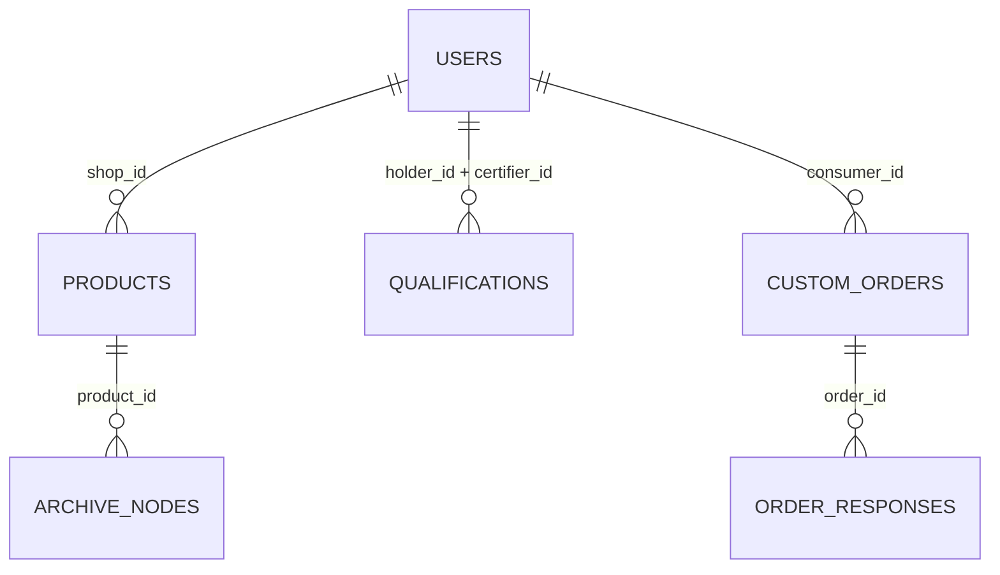

# 角色、API 与数据库

> 本文档承接 [[系统架构全景]]，详细说明五类用户能做什么、调什么接口、数据存哪里。

---

## 一、角色与 ABE 概念的对应

| 角色 | ABE 角色 | 核心操作 | 预置账号 |
|------|---------|----------|---------|
| 🛒 消费者 | **DataOwner** | 设定访问策略，加密发布需求 | `shike` |
| 🏭 商家 | **DataUser** | 持有属性密钥，解密查看需求 | `fujianmingpin` 等 4 个 |
| 🏛️ 审核方 | **AttributeAuthority** | 颁发/撤销属性密钥 | `fujiangongshang`, `youjirenzheng` |
| ⚙️ 管理员 | 超级用户 | 全局管理 + 系统密钥轮换 | `admin` |
| 🔍 监管方 | 审计者 | 追溯查询 + 应急解密 | `shiyaojian` |

---

## 二、消费者（DataOwner）

**账号**: `shike` / `123456`

### 页面和功能

| 页面 | 调用的 API |
|------|-----------|
| 发现好物（搜索/浏览 28 种商品） | `GET /api/products`, `GET /api/products/:id` |
| **私人定制**（设定 ABE 条件 → 加密发布） | `POST /api/custom-order` |
| 定制广场（浏览公开需求） | `GET /api/public-orders` |
| 我的需求（查看已发布 + 商家响应 + 删除） | `GET /api/custom-orders`, `DELETE /api/custom-orders/:id` |
| 购物车（加减/结算） | `POST /api/orders` |
| 个人中心 | `PUT /api/user/profile` |

### ABE 操作：发布加密需求

前端页面 `custom-order.js` → 用户选择条件（下拉框选 `Location=福建`, `Capability=制茶`）→ 调用 `API.createCustomOrder()` → 后端 `HandleCreateCustomOrder`：

```
1. ConditionToPolicy({Location:"福建", Capability:"制茶"}) → "(Location=福建, Capability=制茶; 2)"
2. EncryptWithABE(描述) → Java ABE 加密 → 返回 sessionID + 密文
3. INSERT INTO custom_orders (title, policy, session_id, ciphertext, ...)
4. 前端收到 {status:"success", policy_tip:"产地要求：福建 | 加工能力：制茶"}
```

---

## 三、商家（DataUser）

**账号**: `fujianmingpin` / `123456`（4 项资质，最全面）

### 商家资质详情

| 商家 | 有效资质 | 能解密的需求条件 |
|------|---------|----------------|
| 福建名品茶厂 | Location=福建, Capability=制茶, Grade=3 | 需要福建/制茶/3级的需求 |
| 山东丰收食品厂 | Location=山东 | 需要山东的需求 |
| 浙江龙井茶园 | Location=浙江, Quality=有机 | 需要浙江/有机的需求 |
| 草原牧业 | 无 | 无法解密任何加密需求 |

### ABE 操作：解密验证需求

```
1. 商家点击需求卡片「ABE 解密验证」
2. POST /api/custom-orders/:id/decrypt {merchant_id: "u2"}
3. 后端获取商家有效资质 → {Location:"福建", Capability:"制茶", Grade:"3"}
4. DecryptWithABE(密文, 资质) → Java ABE 解密
5. 成功 → 显示原文，可接单报价
   失败 → 显示"资质不满足"，引导申请资质
```

### 页面和 API

| 页面 | 调用的 API |
|------|-----------|
| 工作台 | 多个 GET 聚合 |
| 商品管理 | `GET /api/my-products`, `POST /api/products`, `DELETE /api/products/:id` |
| **需求市场** | `GET /api/demand-market`, **`POST /api/custom-orders/:id/decrypt`** |
| 我的资质 | `GET /api/my-qualifications`, `POST /api/qualifications/apply` |
| 订单管理 | `GET /api/merchant/orders`, `PUT /api/orders/:id/status` |

---

## 四、审核方（AttributeAuthority）

**管辖分工**：

| 审核方 | 管辖属性 |
|--------|---------|
| 福建省工商认证中心 | `Location`, `Grade` |
| 有机食品认证协会 | `Quality`, `Organic` |

### ABE 操作：撤销属性

```
1. 审核方点击「收回」资质
2. POST /api/qualifications/:id/revoke
3. DB: status → 'revoked'
4. RevokeAttribute("Location", "福建") → Java ABE POST /api/revoke
5. ABE 系统公钥更新 → 持有该属性的所有用户私钥失效
```

### 页面和 API

| 页面 | 调用的 API |
|------|-----------|
| 审核管理 | `GET /api/review-list`, `POST /api/review/:id/approve`, `POST /api/review/:id/reject` |
| 资质管理 | **`POST /api/qualifications/:id/revoke`**, `PUT .../renew`, `PUT .../restore` |
| 审核历史 | `GET /api/my-qualifications`（全部） |

---

## 五、管理员

### ABE 操作：系统密钥轮换

```
1. 管理员点击「更新认证规则」
2. POST /api/admin/sys-update
3. UpdateSystemKeys() → Java ABE POST /api/rekey → 新主密钥
4. ExpireAllQualifications() → 所有 active 资质 → expired
5. 所有商家必须重新申请资质
```

### 页面和 API

| 页面 | 调用的 API |
|------|-----------|
| 用户管理 | `GET /api/admin/users`, `DELETE /api/admin/users/:id` |
| 规则管理 | **`POST /api/admin/sys-update`** |
| 内容审核 | `GET /api/products` + 管理操作 |

---

## 六、监管方

### ABE 操作：应急解密

```
POST /api/regulator/emergency {product_id: "p1"}
→ 返回全链路追溯档案（包括加密节点）
```

---

## 七、完整 API 列表（40 条）

### 认证（3 条）

```
POST /api/auth/login       # 登录（用户名+密码）
POST /api/auth/register    # 注册
PUT  /api/user/profile     # 更新个人信息
```

### 商品（5 条）

```
GET    /api/products            # 列表（?keyword=&category=&origin=）
GET    /api/products/:id        # 详情
GET    /api/my-products         # 商家商品（?shop_id=）
POST   /api/products            # 发布
DELETE /api/products/:id        # 下架
```

### 产品档案（1 条）

```
GET /api/archive/:productId     # 追溯档案（?role=）
```

### 定制需求 — ABE 核心（7 条）

```
POST   /api/custom-order                # 🔐 发布加密需求
GET    /api/custom-orders               # 我的需求（?consumer_id=）
GET    /api/custom-orders/:id           # 需求详情
POST   /api/custom-orders/:id/respond   # 商家响应
DELETE /api/custom-orders/:id           # 删除
POST   /api/custom-orders/:id/decrypt   # 🔐 ABE 解密验证
GET    /api/public-orders               # 公开需求列表
```

### 购买订单（4 条）

```
POST /api/orders                  # 创建
GET  /api/merchant/orders         # 商家订单（?merchant_id=）
GET  /api/consumer/orders         # 消费者订单（?consumer_id=）
PUT  /api/orders/:id/status       # 更新状态
```

### 需求市场（1 条）

```
GET /api/demand-market            # 资质匹配（?merchant_id=）
```

### 资质管理 — ABE 撤销（6 条）

```
GET  /api/my-qualifications           # 我的资质（?holder_id=）
POST /api/qualifications/apply        # 申请
POST /api/qualifications/:id/revoke   # 🔐 收回（触发 ABE 撤销）
PUT  /api/qualifications/:id/renew    # 续期
PUT  /api/qualifications/:id/restore  # 恢复
```

### 审核方（3 条）

```
GET  /api/review-list             # 待审列表
POST /api/review/:id/approve      # 通过
POST /api/review/:id/reject       # 驳回
```

### 管理员 — ABE 轮换（5 条）

```
GET    /api/admin/users           # 全部用户
DELETE /api/admin/users/:id       # 删除用户
GET    /api/admin/qualifications  # 全部资质
GET    /api/admin/orders          # 全部需求
POST   /api/admin/sys-update      # 🔐 系统密钥轮换
```

### 监管方（2 条）

```
GET  /api/regulator/search        # 档案搜索（?keyword=）
POST /api/regulator/emergency     # 应急解密
```

---

## 八、数据库设计

**数据库**：`fruit_platform`（MySQL 8.0 Docker）

### ER 关系



### 7 张表

#### users（9 行种子数据）

| 字段 | 类型 | 说明 |
|------|------|------|
| `id` | VARCHAR PK | u1-u9 |
| `username` | VARCHAR UK | 登录名 |
| `password` | VARCHAR | 明文（开发环境） |
| `name` | VARCHAR | 显示名 |
| `role` | VARCHAR | consumer/merchant/certifier/admin/regulator |
| `phone`, `location` | VARCHAR | 联系信息 |

#### products（28 行种子数据）

| 字段 | 类型 | 说明 |
|------|------|------|
| `id` | VARCHAR PK | p1-p28 |
| `name` | VARCHAR | 商品名 |
| `category` | VARCHAR | 茶叶/果蔬/谷物/畜牧/菌菇/蜂蜜/零食/粮油 |
| `origin` | VARCHAR | 产地 |
| `price` | DECIMAL | 价格 |
| `certification` | VARCHAR | 有机/绿色/地理标志/无公害 |
| `traceable` | BOOLEAN | 是否可追溯 |
| `shop_id` | VARCHAR FK | 所属商家 |

#### qualifications（7 行种子数据）⚠️ ABE 核心

| 字段 | 类型 | 说明 |
|------|------|------|
| `id` | VARCHAR PK | q1-q7 |
| `holder_id` | VARCHAR FK | 持有者（商家） |
| `qual_type` | VARCHAR | **ABE 属性类型**: Location/Capability/Quality/Grade/Organic |
| `qual_value` | VARCHAR | **ABE 属性值**: 福建/制茶/有机/3/是 |
| `status` | VARCHAR | active/pending/expired/revoked/rejected |
| `certifier_id` | VARCHAR FK | 颁发方 |

**状态机**：

```
pending → active（审核通过）
active → revoked（审核方收回，触发 ABE 撤销）
active → expired（管理员 SysUpdate，全局过期）
revoked → active（恢复）
expired → active（续期）
```

#### custom_orders ⚠️ ABE 加密核心

| 字段 | 类型 | 说明 |
|------|------|------|
| `id` | VARCHAR PK | CO001, CO002... |
| `title` | VARCHAR | 需求标题（公开） |
| `description` | TEXT | 原文备份（前端不展示） |
| `budget` | VARCHAR | 预算 |
| `policy` | VARCHAR | **ABE 策略表达式** |
| `session_id` | VARCHAR | **Java ABE 会话 ID** |
| `ciphertext` | TEXT | **ABE 密文** |
| `status` | VARCHAR | active/closed |

#### order_responses

| 字段 | 说明 |
|------|------|
| `id`, `order_id` FK, `merchant_id` FK | 关联 |
| `name`, `price`, `message` | 商家报价信息 |

#### orders

| 字段 | 说明 |
|------|------|
| `id`, `consumer_id`, `merchant_id`, `product_id` | 关联 |
| `quantity`, `price`, `total` | 数量/单价/总价 |
| `status` | pending→confirmed→shipped→delivered→completed |

#### archive_nodes ⚠️ 部分加密

| 字段 | 类型 | 说明 |
|------|------|------|
| `id` | INT PK AUTO | 自增 |
| `product_id` | VARCHAR FK | 关联商品 |
| `step` | VARCHAR | 种植/加工/质检/运输/到店 |
| `location`, `node_time`, `description` | | 详情 |
| `is_public` | BOOLEAN | **false=加密节点，普通用户不可见** |

---

## 九、初始化流程

```go
// main.go
func main() {
    InitDB(dsn)           // 连接 MySQL
    SeedDemoData()        // 检测每张表，为空则插入种子数据
    PrintStats()          // Users:9 Products:28 Qualifications:7
    InitFabric()          // 尝试连接 Fabric（非阻塞）
    Setup().Run(":8080")  // 启动 HTTP
}
```

---

## 相关文档

- [[ABE属性基加密详解]] — 上面标记了 ⚠️ 的 ABE 操作的完整密码学流程
- [[系统架构全景]] — 这些 API 和表在架构中的位置
- [[部署运维与演示]] — 用预置账号走一遍完整流程
